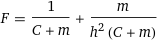
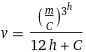

# Extra problems

## 1. [Calculator](task_1.py)
**Examples**:
```commandline
Input a: 8
Input b: 4
a = 8
b = 4
a + b = 12
a - b = 4
a * b = 32
a / b = 2
```

## 2. [Names](task_2.py)
**Examples**:
```commandline
Input first_name: Ivan
Input second_name: Ivanovich
Input last_name: Petrov
FSL format: Ivan Ivanovich Petrov
LFS format: Petrov Ivan Ivanovich
```
> **__Note__**: Don't use commas in ```print```

## 3. [Physics](task_3.py)
На какой-то там планете другие законы физики. Есть главная физическая константа: 
> C = 12.554
Программа запрашивает ```m```(массу) и ```h```(высоту). И считает силу и скорость по формулам:




Examples:
```commandline
Pass m: 1
Pass v: 2
F = -0.14755791648221928
v = 5.258218510216488e-12
```
